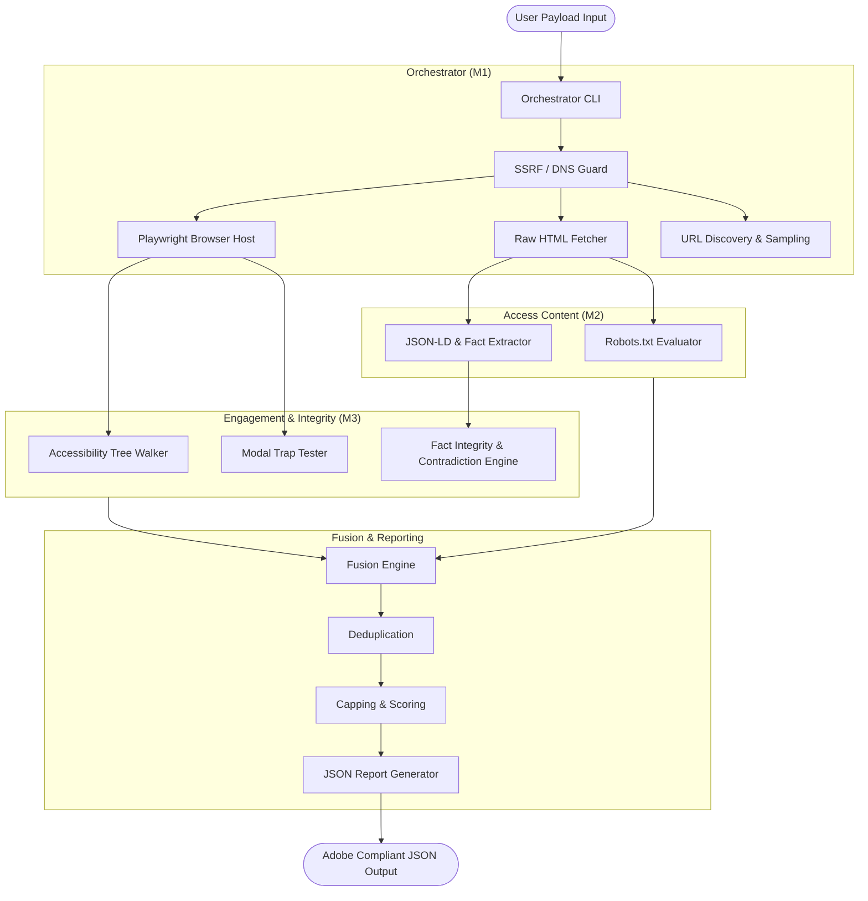

# AIMLESS: AI-Readiness & Engagement Auditor

An **multi-skill agent audit system** designed to evaluate any website's **"AI Discoverability"** and **"On-Site Engagement"**. Built for the Adobe Hackathon Round 3, this tool helps brands understand why they are invisible to AI assistants (like ChatGPT, Claude, or Perplexity) and why visitors or automated agents bounce when they arrive on site.

## Key Features
*   **Security-First Execution:** Bounded network interception, SSRF guards, and strictly non-mutating Playwright interactions.
*   **Heuristic & Structured Fact Extractor:** Extracts and normalizes contextual entities (prices, currencies, billing periods) to find schema contradictions.
*   **Interaction Verification:** Actively traces focus states and evaluates navigation health to prove modal traps and broken routes.
*   **Modular Architecture:** Composed of four discrete, portable skills evaluating discoverability, content access, fact integrity, and engagement safely without violating safety guardrails (SSRF protection, 180s hard timeout limits).

---

## 🏛 Architecture

The project operates as an **Agent Skill Marketplace**, orchestrated by a central Fusion Engine. We enforce strict separation of concerns, executing audits concurrently without violating safety guardrails (SSRF protection, 180s hard timeout limits).



---

## 📁 Folder Structure

```text
Adobe/
├── .github/workflows/       # CI/CD pipeline (Continuous Integration)
├── docs/                    # Field research trails and architecture references
│   └── field_research.md    # Real-world site studies (Tesla, Amazon, GDPR sites)
├── skills/                  # Core entrypoint execution scripts
│   └── audit-orchestrator/
│       └── scripts/
│           └── orchestrate.py  # Main CLI entrypoint
├── src/
│   ├── access_content/      # M2: Robots checking, Schema.org parsing, Fuzzy semantic extraction
│   ├── browser/             # Playwright network interceptors and stealth evasions
│   ├── engagement/          # M3: Modal/accessibility testing, Interactive flow auditing
│   ├── fact_integrity/      # M3: Date/Price mismatching, Wikidata disambiguation
│   ├── fetching/            # HTTP connection management and raw payload fetches
│   ├── fusion/              # Signal aggregation, severity scoring, and capping
│   ├── orchestration/       # Bootstrapping, Context building, and logger mechanisms
│   ├── reporting/           # Generates final Adobe-compliant JSON reports and narrative summaries
│   ├── robots/              # Robots.txt retrieving
│   ├── sampling/            # Page discovery and BFS crawling (limited depth)
│   ├── schemas/             # Pydantic v1 strictly-typed models
│   └── security/            # Protections against SSRF and arbitrary redirect logic
├── tests/
│   ├── fixtures/            # Mock HTML files and wild-site tests
│   ├── integration/         # Integration tests ensuring end-to-end functionality
│   ├── security/            # Tests enforcing SSRF/DNS safety bounds
│   └── unit/                # Component-level testing
├── requirements.txt         # Production dependencies
└── README.md                # You are here
```

---

## 🚀 Setup & Commands

### Prerequisites
Ensure you have Python 3.10+ installed on your system.

### 1. Installation
```bash
# Clone the repository
git clone https://github.com/KartikSisodia217/Adobe.git
cd Adobe

# Install Python dependencies (including CI-compatible stealth)
pip install -r requirements.txt

# Install Playwright and Linux OS dependencies for Chromium
playwright install --with-deps chromium
```

### 2. Running an Audit
The system is designed to be invoked via a single JSON object passed via standard input (`stdin`). This guarantees stateless container execution.

```bash
# Linux / macOS
export PYTHONPATH="."
echo '{"input_url": "https://example.com"}' | python skills/audit-orchestrator/scripts/orchestrate.py

# Windows (PowerShell)
$env:PYTHONPATH="."
echo '{"input_url": "https://example.com"}' | python skills/audit-orchestrator/scripts/orchestrate.py
```

### 3. Running the Test Suite
We utilize `pytest` to ensure 100% functionality and security compliance.
```bash
PYTHONPATH="." python -m pytest tests/
```

---

## 🔍 Modules & Core Capabilities

1. **Bot & Crawlability Evasion (Stealth Mode)**
   * Built on `playwright-stealth` to bypass basic WAF and Bot Management systems.
   * Modifies `navigator.userAgent` and suppresses `AutomationControlled` flags.
2. **Generative Remediation Narratives**
   * Deterministically generates executive summaries ("Narratives") without relying on external LLM APIs (Strict hackathon compliance).
   * Dynamically embeds literal visual code snippets (e.g., `<script type="application/ld+json">`) directly into the Adobe-compliant JSON output to aid developers in fixing errors.
3. **Fuzzy Semantic Extractor**
   * Instead of brittle Regex, relies on `thefuzz` and `python-Levenshtein` to semantically map unstructured DOM facts to structured `JSON-LD` facts (e.g. mapping `"$39,990"` directly to `"39990.00"`).
4. **Active Focus Trap Breaker**
   * Dynamically injects keystrokes (`Escape`) and utilizes visual tree traversal to test if modals, cookie walls, or popups completely disable the accessibility tree for automated systems.

---

## 📚 Field Research & References

Our heuristic detectors are not theoretically derived; they are mapped directly to live architectural faults observed in the wild. Please see `docs/field_research.md` for specific case studies.

**Core Principles Derived From:**
1. *Google Search Central: SEO for AI & Structured Data Guidelines (2024)*
2. *W3C Web Content Accessibility Guidelines (WCAG) 2.2 - Focus Management*
3. *"The JS Rendering Gap" - How Client-Side Rendering Obfuscates Core Commercial Facts (Modern React/Next.js Architecture Patterns).*
4. *Schema.org Ontology completeness requirements for rich snippets.*

---

## 🛡 Guardrails & Security constraints
* **Non-Destructive:** The auditor explicitly blocks form submission (`POST`/`PUT`) and disables arbitrary file downloading.
* **Bounded Execution:** Strict 180-second timeout budget per run, monitored globally by the Orchestrator.
* **SSRF Protection:** Resolves and rejects private CIDR blocks, localhost traversal, and `file://` local read attacks.

## 📄 License
MIT License. Created for the Adobe Hackathon.
