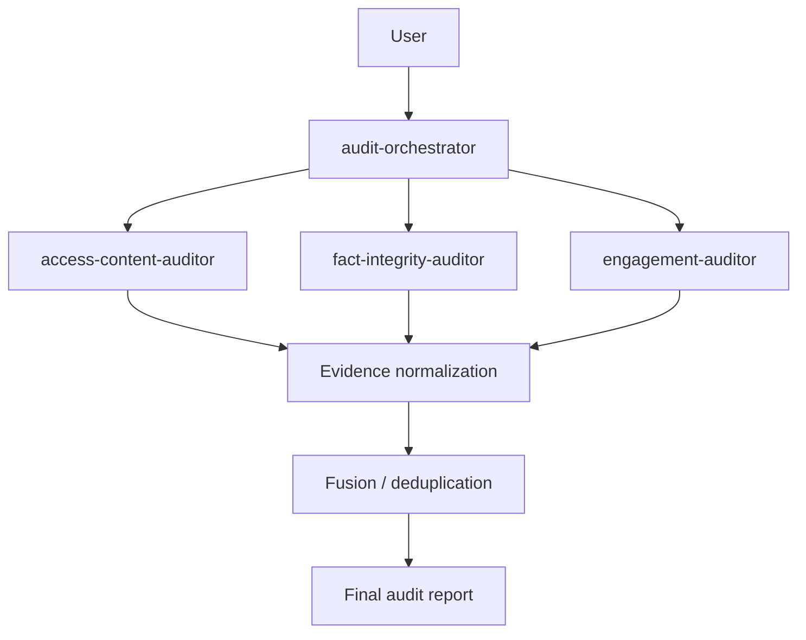

# AIMLESS

AIMLESS is an Agent Skill Marketplace for auditing whether public websites expose important information and interactions in ways that general AI agents can reliably retrieve, interpret, and use.

AIMLESS identifies observable technical, content, and interaction problems and provides grounded corrective actions. It performs evidence-backed auditing through deterministic analysis, read-only operation, bounded sampling, and focused Agent Skills that emit a final fused report.

## 1. What AIMLESS Does

AIMLESS audits public websites for concrete mechanisms that can reduce AI-agent discoverability and usability. 

AIMLESS identifies observable technical/content/interaction problems and provides grounded corrective actions. We DO NOT calculate an "AI readiness score", claim to know exactly how LLMs rank websites, or guarantee AI citations. The system relies entirely on verifiable evidence of technical gaps.

## 2. How the Marketplace Works

The marketplace is intentionally decomposed into focused skills instead of putting every detector into one monolithic skill:



## 3. Skill Marketplace

| Skill | Role | What it actually checks | Output |
|---|---|---|---|
| `audit-orchestrator` | Orchestration | Coordinates the audit lifecycle, normalizes inputs, enforces safety limits, fetches raw/rendered content, and fuses findings. | JSON Audit Report |
| `access-content-auditor` | Detector (Content) | D-01 (retrieval access), E-01 (JS rendering gaps), E-02 (non-text trap). | Evidence-backed findings |
| `fact-integrity-auditor` | Detector (Integrity) | D-02 (structured/visible fact consistency). | Evidence-backed findings |
| `engagement-auditor` | Detector (Interactive) | G-01 (unnamed controls), G-02 (modal traps), G-03 (primary/public route problems). | Evidence-backed findings |

### SKILL 1 — audit-orchestrator

This is the **ONLY entrypoint** for the marketplace. It accepts an audit request, normalizes and validates the URL, enforces SSRF protections, retrieves robots.txt safely, selects a bounded representative set of pages, performs bounded raw HTTP fetching, manages the sandboxed browser, invokes the focused auditor skills, collects and deduplicates their findings, validates findings across signals, assigns final severity/confidence, selects recommendations, and emits the final JSON report.

*Note: It is the composition/orchestration skill, not the primary detector itself.*

### SKILL 2 — access-content-auditor

This skill focuses on access and machine extractability. It checks:
- **D-01 (retrieval/access restrictions)**: Checks whether public content is explicitly inaccessible to relevant retrieval/search agents, with severity based on observed scope.
- **E-01 (JavaScript rendering gaps)**: Checks whether important stable information exists only after JavaScript rendering when no equivalent machine-readable/raw representation exists.
- **E-02 (meaningful non-text information)**: Checks important informational content conveyed through non-text media when a machine-readable/text equivalent is absent.

It DOES NOT flag: JavaScript merely being present, decorative images, generic logos/icons, missing metadata alone, or missing llms.txt alone.

### SKILL 3 — fact-integrity-auditor

This skill focuses on the consistency and integrity of factual information. It checks:
- **D-02 (structured/visible fact consistency)**: Compares relevant visible facts against structured data and related page representations to identify material contradictions.

It DOES NOT claim functionality that is not implemented. Missing schema alone is not treated as a defect, multiple external results do not automatically prove ambiguity, first-party identity signals are prioritized, and external corroboration is bounded.

### SKILL 4 — engagement-auditor

This skill focuses on interactive controls and uses a bounded BrowserAdapter rather than unrestricted Playwright access for read-only interaction checks. It checks:
- **G-01 (unnamed essential controls)**: Checks whether essential task controls have usable computed accessible names.
- **G-02 (modal traps)**: Checks whether a blocking overlay prevents progress and whether safe exits/focus paths fail.
- **G-03 (primary/public route problems)**: Checks whether an important inferred public task route is unavailable, unnamed, or unusable.

It does NOT receive raw Page access.

## 4. What a Finding Looks Like

Every finding is evidence-backed. For example:

```json
{
  "id": "E-01",
  "title": "Core facts missing from raw HTML (JS required)",
  "severity": "Medium",
  "evidence": "Fact 'availability' missing without JS rendering.",
  "suggested_action": "Ensure core content is accessible in raw HTML."
}
```
A finding includes its ID, title, severity, verifiable evidence, and a suggested action.

## 5. Output

The final report structure is emitted as a JSON object by the orchestrator. It contains:
- `site`: The target URL
- `audited_at`: Timestamp
- `audit_version`: Marketplace version
- `summary`: High-level aggregated statistics
- `coverage`: Scope of pages/links evaluated
- `findings`: Confirmed defects
- `proactive_suggestions`: Proactive improvements, separated from confirmed defects

## 6. Safety Model

AIMLESS operates under a strict **READ-ONLY, RECOMMEND-ONLY** policy.
It does not submit forms, modify websites, authenticate, upload content, purchase anything, send messages, or delete anything.

Safety features include:
- SSRF protection and private IP blocking
- Redirect validation and DNS validation
- Browser sandbox with network policy restrictions
- Bounded requests, rendering, and runtime limits

## 7. Resource Bounds

AIMLESS enforces actual limits to preserve stability and bound costs:
- **Max raw pages**: 12
- **Max rendered pages**: 5
- **Browser startup timeout**: 18s
- **Navigation timeout**: 10s
- **File size limits**: Max 2MB per raw fetch
- **Concurrency**: Bounded by asyncio and playwright contexts

## 8. Installation

```bash
python3 -m venv venv
source venv/bin/activate
pip install -r requirements.txt
playwright install chromium
```

## 9. Usage

Invoke the marketplace through its single entrypoint via stdin:

```bash
echo '{"input_url":"https://example.com"}' | python skills/audit-orchestrator/scripts/orchestrate.py
```
Output will be returned as machine-readable JSON on stdout. Logs will be written to stderr.

## 10. Testing

Run tests and marketplace validation:

```bash
pytest -q
```
To validate the final ZIP, extract it into a fresh directory and run tests inside that directory.

## 11. Limitations

- Bounded sampling rather than exhaustive crawling (may miss unlinked pages).
- Limited Shadow DOM coverage.
- Canvas/WebGL limitations in extraction.
- Strict public-site scope (no authenticated content).
- No destructive interactions are permitted.

These limitations exist by design and do not contribute to a "degraded AI readiness score" (as no generic score exists).

## 12. Marketplace Structure

```text
skills/
├── audit-orchestrator/       # The entrypoint and orchestrator skill
├── access-content-auditor/   # D-01, E-01, E-02
├── fact-integrity-auditor/   # D-02
└── engagement-auditor/       # G-01, G-02, G-03

src/                          # Shared schemas, models, utilities, and security logic
tests/                        # Test suite
```

## 13. Design Principles

- **Prove the mechanism before reporting it**: No hypothetical problems.
- **Precision over uncertain coverage**: False negatives are better than false positives.
- **Representative sampling**: Check critical paths rather than full crawls.
- **Deterministic evidence**: Reports must be verifiable.
- **Focused skill decomposition**: Agents have constrained, specialized tasks.
- **Bounded dependencies & read-only operation**: Ensure absolute safety.
- **Honest coverage notes**: Disclose what was and wasn't tested.

## 14. Hackathon Submission

This repository is structured as an Agent Skill Marketplace with a marketplace manifest (`marketplace.json`), four distinct skills (`audit-orchestrator` and three detectors), one designated entrypoint, reusable focused auditors, and machine-readable final output.
